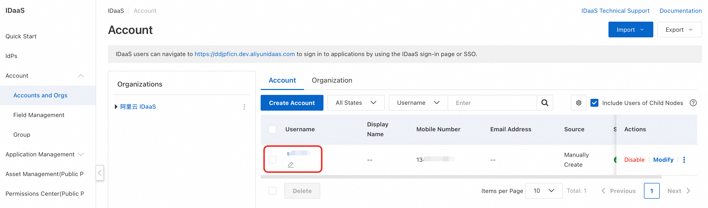
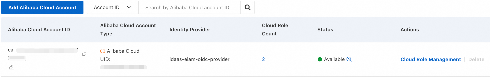
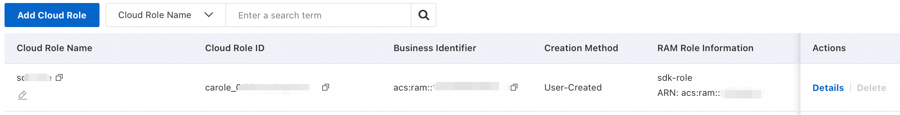
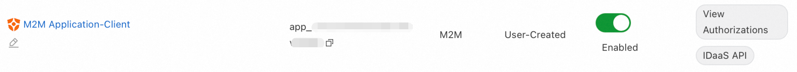
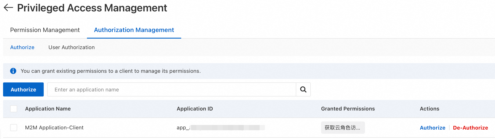
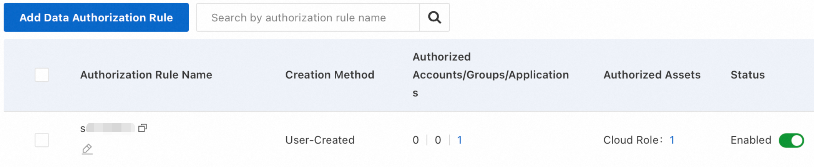

# IDaaS java core sdk
IDaaS core sdk authenticates with IDaaS using user-specified configurations to acquire a JWT-compliant Access Token. Authentication method support: CLIENT_SECRET_POST, CLIENT_SECRET_JWT, PRIVATE_KEY_JWT, PKCS7, OIDC. Deployment environment support: Local computer, Alibaba cloud ECS, Alibaba cloud ACK. 

## Obtain temporary credentials for Alibaba Cloud RAM role
IDaaS has launched the AKless solution, enabling users to securely obtain temporary credentials for Alibaba Cloud RAM role without using Access Keys. Combined with IDaaS java akless alibabacloud adapter SDK, AKless integration can be completed to obtain temporary credentials for Alibaba Cloud RAM role and access or operate cloud resources
### Requirements
Details can be found at: https://github.com/cloud-idaas/idaas-java-akless-alibabacloud-adapter
#### 1. Create Account
Account > Accounts and Orgs, Create an account for SSO login in the development environment.


#### 2. Create Cloud Account and Cloud Role
Delegate the target Alibaba Cloud account (AliUid) and its RAM role to IDaaS, configure a trust policy in RAM Console to authorize the specified IDaaS instance(as an OIDC identity provider) to request temporary security credentials on its behalf.
##### Create Cloud Account

##### Create Cloud Role


#### 3. Create M2M Client Application
Create an M2M client application in IDaaS to initiate authentication requests to the PAM (Privileged Access Management) application on behalf of the service.      
Client Application     


#### 4. Authorize the M2M Client Application
The M2M client application need complete feature permission and data permission to obtain temporary credentials for RAM role via the PAM application.
##### 1. Feature Permission

##### 2. Data Permission


### Integration
#### Import Dependencies
```yaml
<dependency>
    <groupId>com.cloud-idaas</groupId>
    <artifactId>idaas-java-core-sdk</artifactId>
    <version>0.0.1-beta</version>
</dependency>
<dependency>
    <groupId>com.cloud-idaas</groupId>
    <artifactId>idaas-java-akless-alibabacloud-adapter</artifactId>
    <version>0.0.1-beta</version>
</dependency>
```
Other configuration details can be found at: https://github.com/cloud-idaas/idaas-java-akless-alibabacloud-adapter

### Sample
https://github.com/cloud-idaas/akless-sample
